# 理解TCP连接建立过程

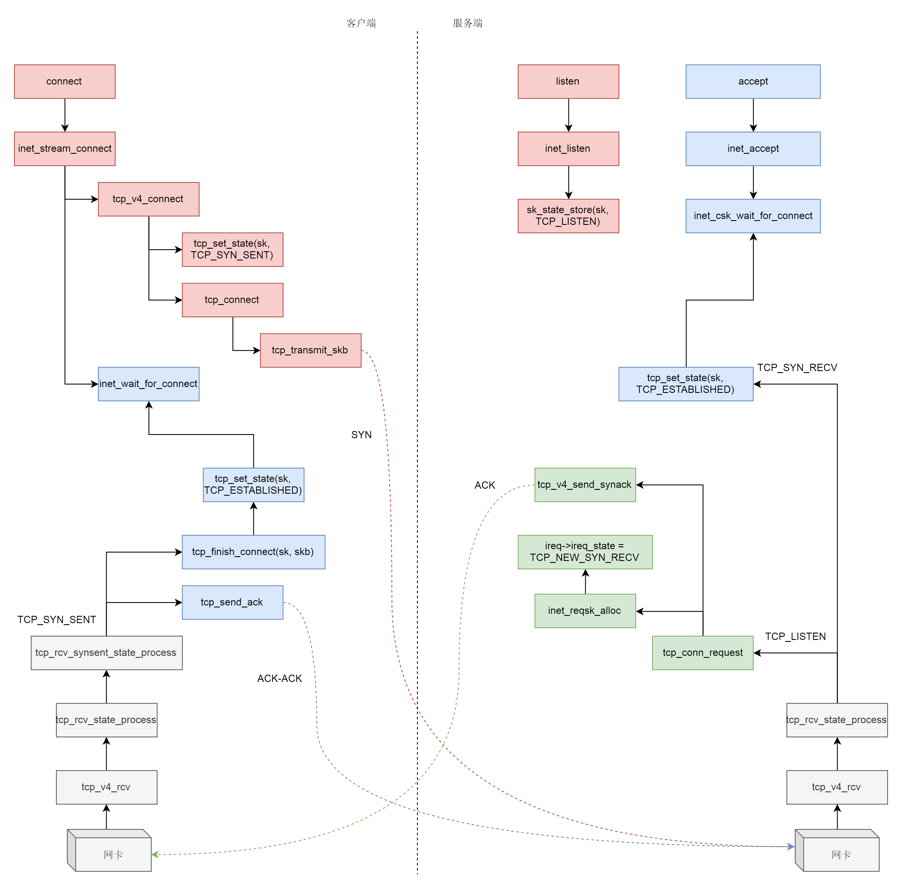

* <https://programmer.ink/think/socket-kernel-data-structure.html>

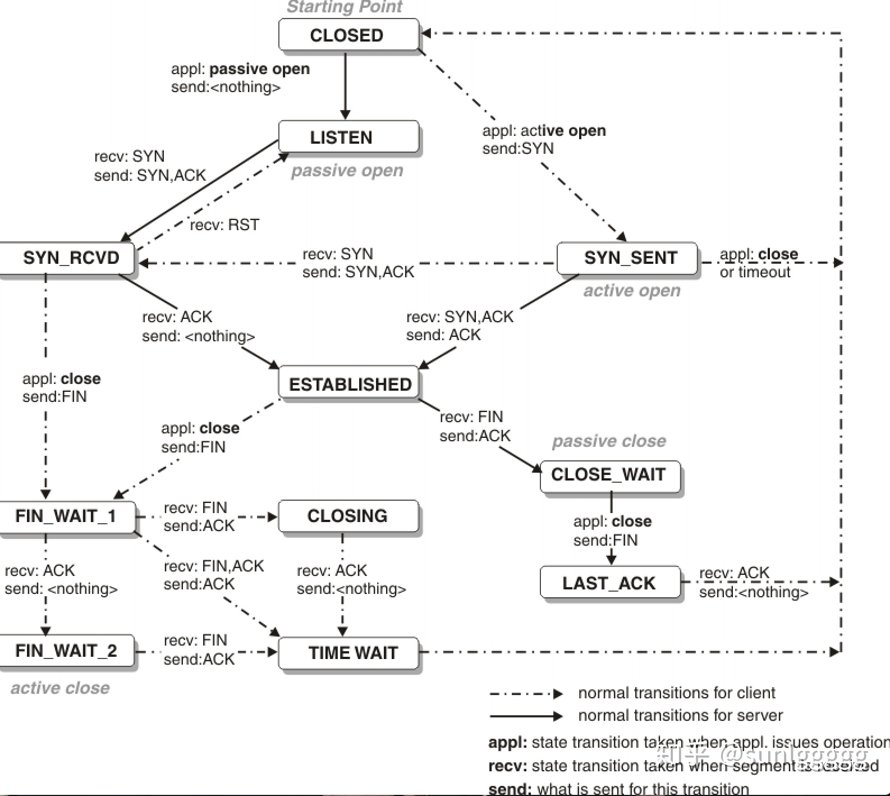

---

## sys_listen

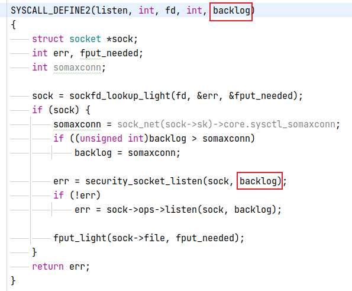

```
/*
 *	Move a socket into listening state.
 */
int inet_listen(struct socket *sock, int backlog)
{
	struct sock *sk = sock->sk;
	unsigned char old_state;
	int err;

	lock_sock(sk);

	err = -EINVAL;
	if (sock->state != SS_UNCONNECTED || sock->type != SOCK_STREAM)
		goto out;

	old_state = sk->sk_state;
	if (!((1 << old_state) & (TCPF_CLOSE | TCPF_LISTEN)))
		goto out;

	/* Really, if the socket is already in listen state
	 * we can only allow the backlog to be adjusted.
	 */
	if (old_state != TCP_LISTEN) {
		/* Check special setups for testing purpose to enable TFO w/o
		 * requiring TCP_FASTOPEN sockopt.
		 * Note that only TCP sockets (SOCK_STREAM) will reach here.
		 * Also fastopenq may already been allocated because this
		 * socket was in TCP_LISTEN state previously but was
		 * shutdown() (rather than close()).
		 */
		if ((sysctl_tcp_fastopen & TFO_SERVER_ENABLE) != 0 &&
		    inet_csk(sk)->icsk_accept_queue.fastopenq == NULL) {
			if ((sysctl_tcp_fastopen & TFO_SERVER_WO_SOCKOPT1) != 0)
				err = fastopen_init_queue(sk, backlog);
			else if ((sysctl_tcp_fastopen &
				  TFO_SERVER_WO_SOCKOPT2) != 0)
				err = fastopen_init_queue(sk,
				    ((uint)sysctl_tcp_fastopen) >> 16);
			else
				err = 0;
			if (err)
				goto out;
		}
		err = inet_csk_listen_start(sk, backlog); // 关键
		if (err)
			goto out;
	}
	sk->sk_max_ack_backlog = backlog; // 关键
	err = 0;

out:
	release_sock(sk);
	return err;
}
EXPORT_SYMBOL(inet_listen);
```

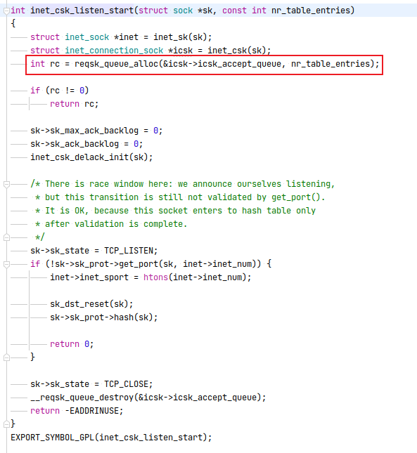

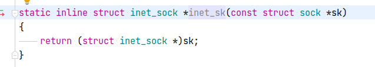

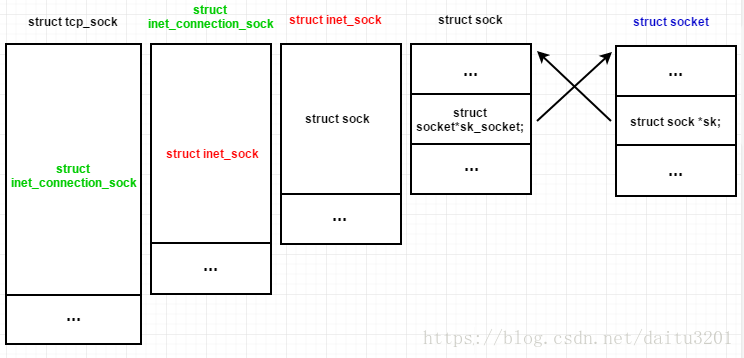

```
struct inet_connection_sock {
	/* inet_sock has to be the first member! */
	struct inet_sock	  icsk_inet;

	struct request_sock_queue icsk_accept_queue; // 全连接、半连接队列

	struct inet_bind_bucket	  *icsk_bind_hash;
	unsigned long		  icsk_timeout;
 	struct timer_list	  icsk_retransmit_timer;
 	struct timer_list	  icsk_delack_timer;
	__u32			  icsk_rto;
	__u32			  icsk_pmtu_cookie;
	const struct tcp_congestion_ops *icsk_ca_ops;
	const struct inet_connection_sock_af_ops *icsk_af_ops;
	unsigned int		  (*icsk_sync_mss)(struct sock *sk, u32 pmtu);
	__u8			  icsk_ca_state;
	__u8			  icsk_retransmits;
	__u8			  icsk_pending;
	__u8			  icsk_backoff;
	__u8			  icsk_syn_retries;
	__u8			  icsk_probes_out;
	__u16			  icsk_ext_hdr_len;
	struct {
		__u8		  pending;	 /* ACK is pending			   */
		__u8		  quick;	 /* Scheduled number of quick acks	   */
		__u8		  pingpong;	 /* The session is interactive		   */
		__u8		  blocked;	 /* Delayed ACK was blocked by socket lock */
		__u32		  ato;		 /* Predicted tick of soft clock	   */
		unsigned long	  timeout;	 /* Currently scheduled timeout		   */
		__u32		  lrcvtime;	 /* timestamp of last received data packet */
		__u16		  last_seg_size; /* Size of last incoming segment	   */
		__u16		  rcv_mss;	 /* MSS used for delayed ACK decisions	   */
	} icsk_ack;
	struct {
		int		  enabled;

		/* Range of MTUs to search */
		int		  search_high;
		int		  search_low;

		/* Information on the current probe. */
		int		  probe_size;
	} icsk_mtup;
	u32			  icsk_ca_priv[16];
	u32			  icsk_user_timeout;
#define ICSK_CA_PRIV_SIZE	(16 * sizeof(u32))
};
```

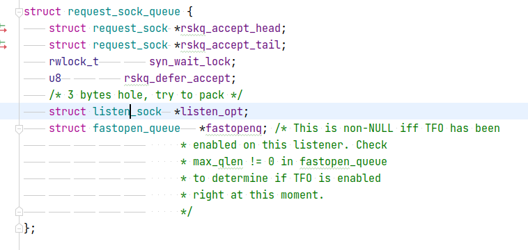

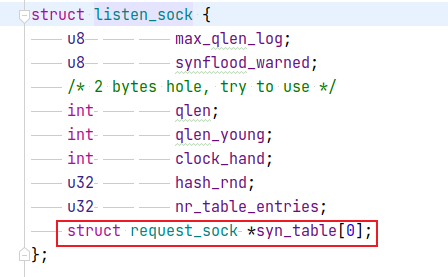

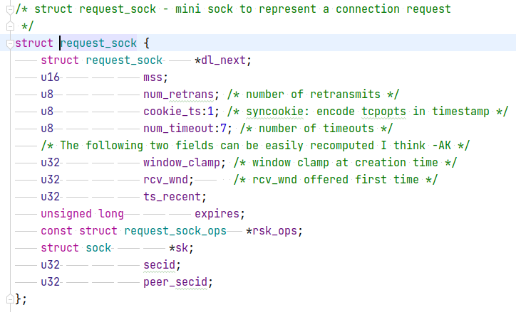

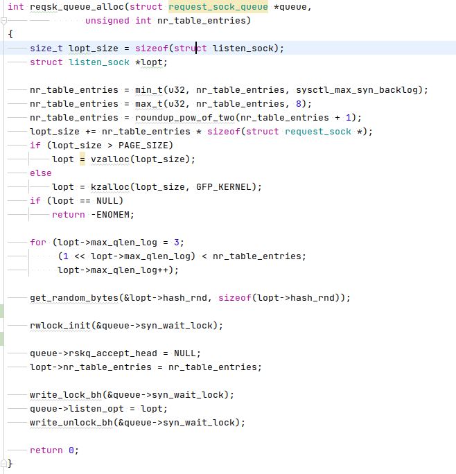


## sys_connect


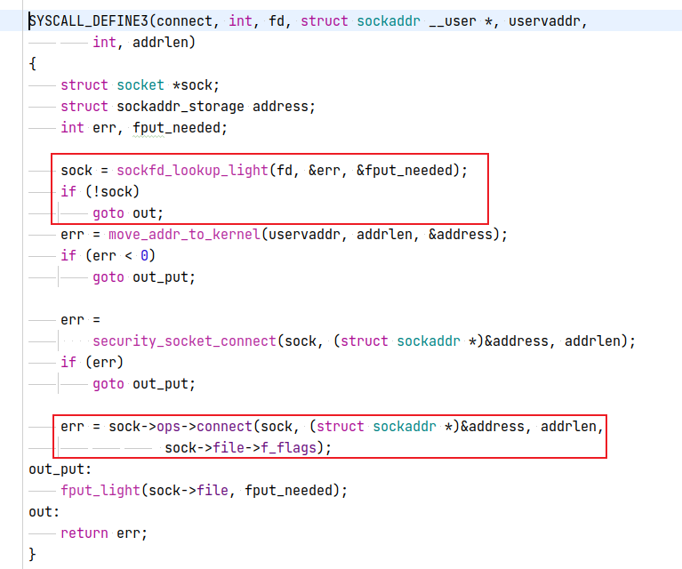

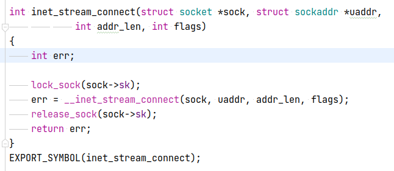

```
/*
 *	Connect to a remote host. There is regrettably still a little
 *	TCP 'magic' in here.
 */
int __inet_stream_connect(struct socket *sock, struct sockaddr *uaddr,
			  int addr_len, int flags)
{
	struct sock *sk = sock->sk;
	int err;
	long timeo;

	if (addr_len < sizeof(uaddr->sa_family))
		return -EINVAL;

	if (uaddr->sa_family == AF_UNSPEC) {
		err = sk->sk_prot->disconnect(sk, flags);
		sock->state = err ? SS_DISCONNECTING : SS_UNCONNECTED;
		goto out;
	}

	switch (sock->state) {
	default:
		err = -EINVAL;
		goto out;
	case SS_CONNECTED:
		err = -EISCONN;
		goto out;
	case SS_CONNECTING:
		err = -EALREADY;
		/* Fall out of switch with err, set for this state */
		break;
	case SS_UNCONNECTED: # 未建立连接
		err = -EISCONN;
		if (sk->sk_state != TCP_CLOSE)
			goto out;

		err = sk->sk_prot->connect(sk, uaddr, addr_len);
		if (err < 0)
			goto out;

		sock->state = SS_CONNECTING;

		/* Just entered SS_CONNECTING state; the only
		 * difference is that return value in non-blocking
		 * case is EINPROGRESS, rather than EALREADY.
		 */
		err = -EINPROGRESS;
		break;
	}

	timeo = sock_sndtimeo(sk, flags & O_NONBLOCK);

	if ((1 << sk->sk_state) & (TCPF_SYN_SENT | TCPF_SYN_RECV)) {
		int writebias = (sk->sk_protocol == IPPROTO_TCP) &&
				tcp_sk(sk)->fastopen_req &&
				tcp_sk(sk)->fastopen_req->data ? 1 : 0;

		/* Error code is set above */
		if (!timeo || !inet_wait_for_connect(sk, timeo, writebias))
			goto out;

		err = sock_intr_errno(timeo);
		if (signal_pending(current))
			goto out;
	}

	/* Connection was closed by RST, timeout, ICMP error
	 * or another process disconnected us.
	 */
	if (sk->sk_state == TCP_CLOSE)
		goto sock_error;

	/* sk->sk_err may be not zero now, if RECVERR was ordered by user
	 * and error was received after socket entered established state.
	 * Hence, it is handled normally after connect() return successfully.
	 */

	sock->state = SS_CONNECTED;
	err = 0;
out:
	return err;

sock_error:
	err = sock_error(sk) ? : -ECONNABORTED;
	sock->state = SS_UNCONNECTED;
	if (sk->sk_prot->disconnect(sk, flags))
		sock->state = SS_DISCONNECTING;
	goto out;
}
EXPORT_SYMBOL(__inet_stream_connect);
```

```err = sk->sk_prot->connect(sk, uaddr, addr_len);```多态，跳转到tcp_v4_connect

```
/* This will initiate an outgoing connection. */
int tcp_v4_connect(struct sock *sk, struct sockaddr *uaddr, int addr_len)
{
	struct sockaddr_in *usin = (struct sockaddr_in *)uaddr;
	struct inet_sock *inet = inet_sk(sk);
	struct tcp_sock *tp = tcp_sk(sk);
	__be16 orig_sport, orig_dport;
	__be32 daddr, nexthop;
	struct flowi4 *fl4;
	struct rtable *rt;
	int err;
	struct ip_options_rcu *inet_opt;

	if (addr_len < sizeof(struct sockaddr_in))
		return -EINVAL;

	if (usin->sin_family != AF_INET)
		return -EAFNOSUPPORT;

	nexthop = daddr = usin->sin_addr.s_addr;
	inet_opt = rcu_dereference_protected(inet->inet_opt,
					     sock_owned_by_user(sk));
	if (inet_opt && inet_opt->opt.srr) {
		if (!daddr)
			return -EINVAL;
		nexthop = inet_opt->opt.faddr;
	}

	orig_sport = inet->inet_sport;
	orig_dport = usin->sin_port;
	fl4 = &inet->cork.fl.u.ip4;
	rt = ip_route_connect(fl4, nexthop, inet->inet_saddr,
			      RT_CONN_FLAGS(sk), sk->sk_bound_dev_if,
			      IPPROTO_TCP,
			      orig_sport, orig_dport, sk, true);
	if (IS_ERR(rt)) {
		err = PTR_ERR(rt);
		if (err == -ENETUNREACH)
			IP_INC_STATS_BH(sock_net(sk), IPSTATS_MIB_OUTNOROUTES);
		return err;
	}

	if (rt->rt_flags & (RTCF_MULTICAST | RTCF_BROADCAST)) {
		ip_rt_put(rt);
		return -ENETUNREACH;
	}

	if (!inet_opt || !inet_opt->opt.srr)
		daddr = fl4->daddr;

	if (!inet->inet_saddr)
		inet->inet_saddr = fl4->saddr;
	inet->inet_rcv_saddr = inet->inet_saddr;

	if (tp->rx_opt.ts_recent_stamp && inet->inet_daddr != daddr) {
		/* Reset inherited state */
		tp->rx_opt.ts_recent	   = 0;
		tp->rx_opt.ts_recent_stamp = 0;
		if (likely(!tp->repair))
			tp->write_seq	   = 0;
	}

	if (tcp_death_row.sysctl_tw_recycle &&
	    !tp->rx_opt.ts_recent_stamp && fl4->daddr == daddr)
		tcp_fetch_timewait_stamp(sk, &rt->dst);

	inet->inet_dport = usin->sin_port;
	inet->inet_daddr = daddr;

	inet_csk(sk)->icsk_ext_hdr_len = 0;
	if (inet_opt)
		inet_csk(sk)->icsk_ext_hdr_len = inet_opt->opt.optlen;

	tp->rx_opt.mss_clamp = TCP_MSS_DEFAULT;

	/* Socket identity is still unknown (sport may be zero).
	 * However we set state to SYN-SENT and not releasing socket
	 * lock select source port, enter ourselves into the hash tables and
	 * complete initialization after this.
	 */
	tcp_set_state(sk, TCP_SYN_SENT);
	err = inet_hash_connect(&tcp_death_row, sk);
	if (err)
		goto failure;

	rt = ip_route_newports(fl4, rt, orig_sport, orig_dport,
			       inet->inet_sport, inet->inet_dport, sk);
	if (IS_ERR(rt)) {
		err = PTR_ERR(rt);
		rt = NULL;
		goto failure;
	}
	/* OK, now commit destination to socket.  */
	sk->sk_gso_type = SKB_GSO_TCPV4;
	sk_setup_caps(sk, &rt->dst);

	if (!tp->write_seq && likely(!tp->repair))
		tp->write_seq = secure_tcp_sequence_number(inet->inet_saddr,
							   inet->inet_daddr,
							   inet->inet_sport,
							   usin->sin_port);

	inet->inet_id = tp->write_seq ^ jiffies;

	err = tcp_connect(sk);

	rt = NULL;
	if (err)
		goto failure;

	return 0;

failure:
	/*
	 * This unhashes the socket and releases the local port,
	 * if necessary.
	 */
	tcp_set_state(sk, TCP_CLOSE);
	ip_rt_put(rt);
	sk->sk_route_caps = 0;
	inet->inet_dport = 0;
	return err;
}
EXPORT_SYMBOL(tcp_v4_connect);
```

* 先修改状态，再选取动态端口，然后发送SYN包

```
enum {
	TCP_ESTABLISHED = 1,
	TCP_SYN_SENT,
	TCP_SYN_RECV,
	TCP_FIN_WAIT1,
	TCP_FIN_WAIT2,
	TCP_TIME_WAIT,
	TCP_CLOSE,
	TCP_CLOSE_WAIT,
	TCP_LAST_ACK,
	TCP_LISTEN,
	TCP_CLOSING,	/* Now a valid state */

	TCP_MAX_STATES	/* Leave at the end! */
};
```


```
void tcp_set_state(struct sock *sk, int state)
{
	int oldstate = sk->sk_state;

	switch (state) {
	case TCP_ESTABLISHED:
		if (oldstate != TCP_ESTABLISHED)
			TCP_INC_STATS(sock_net(sk), TCP_MIB_CURRESTAB);
		break;

	case TCP_CLOSE:
		if (oldstate == TCP_CLOSE_WAIT || oldstate == TCP_ESTABLISHED)
			TCP_INC_STATS(sock_net(sk), TCP_MIB_ESTABRESETS);

		sk->sk_prot->unhash(sk);
		if (inet_csk(sk)->icsk_bind_hash &&
		    !(sk->sk_userlocks & SOCK_BINDPORT_LOCK))
			inet_put_port(sk);
		/* fall through */
	default:
		if (oldstate == TCP_ESTABLISHED)
			TCP_DEC_STATS(sock_net(sk), TCP_MIB_CURRESTAB);
	}

	/* Change state AFTER socket is unhashed to avoid closed
	 * socket sitting in hash tables.
	 */
	sk->sk_state = state;

#ifdef STATE_TRACE
	SOCK_DEBUG(sk, "TCP sk=%p, State %s -> %s\n", sk, statename[oldstate], statename[state]);
#endif
}
EXPORT_SYMBOL_GPL(tcp_set_state);
```


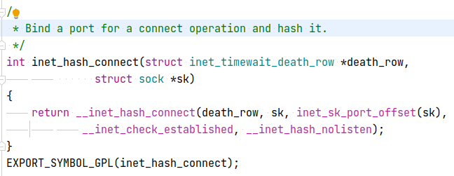

```
int __inet_hash_connect(struct inet_timewait_death_row *death_row,
		struct sock *sk, u32 port_offset,
		int (*check_established)(struct inet_timewait_death_row *,
			struct sock *, __u16, struct inet_timewait_sock **),
		int (*hash)(struct sock *sk, struct inet_timewait_sock *twp))
{
	struct inet_hashinfo *hinfo = death_row->hashinfo;
	const unsigned short snum = inet_sk(sk)->inet_num;
	struct inet_bind_hashbucket *head;
	struct inet_bind_bucket *tb;
	int ret;
	struct net *net = sock_net(sk);
	int twrefcnt = 1;

	if (!snum) {
		int i, remaining, low, high, port;
		static u32 hint;
		u32 offset = hint + port_offset;
		struct inet_timewait_sock *tw = NULL;

		inet_get_local_port_range(&low, &high);
		remaining = (high - low) + 1;

		local_bh_disable();
		for (i = 1; i <= remaining; i++) {
			port = low + (i + offset) % remaining;
			if (inet_is_reserved_local_port(port))
				continue;
			head = &hinfo->bhash[inet_bhashfn(net, port,
					hinfo->bhash_size)];
			spin_lock(&head->lock);

			/* Does not bother with rcv_saddr checks,
			 * because the established check is already
			 * unique enough.
			 */
			inet_bind_bucket_for_each(tb, &head->chain) {
				if (net_eq(ib_net(tb), net) &&
				    tb->port == port) {
					if (tb->fastreuse >= 0 ||
					    tb->fastreuseport >= 0)
						goto next_port;
					WARN_ON(hlist_empty(&tb->owners));
					if (!check_established(death_row, sk,
								port, &tw))
						goto ok;
					goto next_port;
				}
			}

			tb = inet_bind_bucket_create(hinfo->bind_bucket_cachep,
					net, head, port);
			if (!tb) {
				spin_unlock(&head->lock);
				break;
			}
			tb->fastreuse = -1;
			tb->fastreuseport = -1;
			goto ok;

		next_port:
			spin_unlock(&head->lock);
		}
		local_bh_enable();

		return -EADDRNOTAVAIL;

ok:
		hint += i;

		/* Head lock still held and bh's disabled */
		inet_bind_hash(sk, tb, port);
		if (sk_unhashed(sk)) {
			inet_sk(sk)->inet_sport = htons(port);
			twrefcnt += hash(sk, tw);
		}
		if (tw)
			twrefcnt += inet_twsk_bind_unhash(tw, hinfo);
		spin_unlock(&head->lock);

		if (tw) {
			inet_twsk_deschedule(tw, death_row);
			while (twrefcnt) {
				twrefcnt--;
				inet_twsk_put(tw);
			}
		}

		ret = 0;
		goto out;
	}

	head = &hinfo->bhash[inet_bhashfn(net, snum, hinfo->bhash_size)];
	tb  = inet_csk(sk)->icsk_bind_hash;
	spin_lock_bh(&head->lock);
	if (sk_head(&tb->owners) == sk && !sk->sk_bind_node.next) {
		hash(sk, NULL);
		spin_unlock_bh(&head->lock);
		return 0;
	} else {
		spin_unlock(&head->lock);
		/* No definite answer... Walk to established hash table */
		ret = check_established(death_row, sk, snum, NULL);
out:
		local_bh_enable();
		return ret;
	}
}
```

检查端口是否可用

```
/* called with local bh disabled */
static int __inet_check_established(struct inet_timewait_death_row *death_row,
				    struct sock *sk, __u16 lport,
				    struct inet_timewait_sock **twp)
{
	struct inet_hashinfo *hinfo = death_row->hashinfo;
	struct inet_sock *inet = inet_sk(sk);
	__be32 daddr = inet->inet_rcv_saddr;
	__be32 saddr = inet->inet_daddr;
	int dif = sk->sk_bound_dev_if;
	INET_ADDR_COOKIE(acookie, saddr, daddr)
	const __portpair ports = INET_COMBINED_PORTS(inet->inet_dport, lport);
	struct net *net = sock_net(sk);
	unsigned int hash = inet_ehashfn(net, daddr, lport,
					 saddr, inet->inet_dport);
	struct inet_ehash_bucket *head = inet_ehash_bucket(hinfo, hash);
	spinlock_t *lock = inet_ehash_lockp(hinfo, hash);
	struct sock *sk2;
	const struct hlist_nulls_node *node;
	struct inet_timewait_sock *tw;
	int twrefcnt = 0;

	spin_lock(lock);

	/* Check TIME-WAIT sockets first. */
	sk_nulls_for_each(sk2, node, &head->twchain) {
		if (sk2->sk_hash != hash)
			continue;

		if (likely(INET_TW_MATCH(sk2, net, acookie,
					 saddr, daddr, ports, dif))) {
			tw = inet_twsk(sk2);
			if (twsk_unique(sk, sk2, twp))
				goto unique;
			else
				goto not_unique;
		}
	}
	tw = NULL;

	/* And established part... */
	sk_nulls_for_each(sk2, node, &head->chain) {
		if (sk2->sk_hash != hash)
			continue;
		if (likely(INET_MATCH(sk2, net, acookie,
				      saddr, daddr, ports, dif)))
			goto not_unique;
	}

unique:
	/* Must record num and sport now. Otherwise we will see
	 * in hash table socket with a funny identity. */
	inet->inet_num = lport;
	inet->inet_sport = htons(lport);
	sk->sk_hash = hash;
	WARN_ON(!sk_unhashed(sk));
	__sk_nulls_add_node_rcu(sk, &head->chain);
	if (tw) {
		twrefcnt = inet_twsk_unhash(tw);
		NET_INC_STATS_BH(net, LINUX_MIB_TIMEWAITRECYCLED);
	}
	spin_unlock(lock);
	if (twrefcnt)
		inet_twsk_put(tw);
	sock_prot_inuse_add(sock_net(sk), sk->sk_prot, 1);

	if (twp) {
		*twp = tw;
	} else if (tw) {
		/* Silly. Should hash-dance instead... */
		inet_twsk_deschedule(tw, death_row);

		inet_twsk_put(tw);
	}
	return 0;

not_unique:
	spin_unlock(lock);
	return -EADDRNOTAVAIL;
}
```

```
/* Build a SYN and send it off. */
int tcp_connect(struct sock *sk)
{
	struct tcp_sock *tp = tcp_sk(sk);
	struct sk_buff *buff;
	int err;

	tcp_connect_init(sk);

	if (unlikely(tp->repair)) {
		tcp_finish_connect(sk, NULL);
		return 0;
	}

	buff = alloc_skb_fclone(MAX_TCP_HEADER + 15, sk->sk_allocation);
	if (unlikely(buff == NULL))
		return -ENOBUFS;

	/* Reserve space for headers. */
	skb_reserve(buff, MAX_TCP_HEADER);

	tcp_init_nondata_skb(buff, tp->write_seq++, TCPHDR_SYN);
	tp->retrans_stamp = TCP_SKB_CB(buff)->when = tcp_time_stamp;
	tcp_connect_queue_skb(sk, buff);
	TCP_ECN_send_syn(sk, buff);

	/* Send off SYN; include data in Fast Open. */
	err = tp->fastopen_req ? tcp_send_syn_data(sk, buff) :
	      tcp_transmit_skb(sk, buff, 1, sk->sk_allocation);
	if (err == -ECONNREFUSED)
		return err;

	/* We change tp->snd_nxt after the tcp_transmit_skb() call
	 * in order to make this packet get counted in tcpOutSegs.
	 */
	tp->snd_nxt = tp->write_seq;
	tp->pushed_seq = tp->write_seq;
	TCP_INC_STATS(sock_net(sk), TCP_MIB_ACTIVEOPENS);

	/* Timer for repeating the SYN until an answer. */
	inet_csk_reset_xmit_timer(sk, ICSK_TIME_RETRANS,
				  inet_csk(sk)->icsk_rto, TCP_RTO_MAX);
	return 0;
}
EXPORT_SYMBOL(tcp_connect);
```

```
/* Build a SYN and send it off. */
int tcp_connect(struct sock *sk)
{
	struct tcp_sock *tp = tcp_sk(sk);
	struct sk_buff *buff;
	int err;

	tcp_connect_init(sk);

	if (unlikely(tp->repair)) {
		tcp_finish_connect(sk, NULL);
		return 0;
	}

	buff = alloc_skb_fclone(MAX_TCP_HEADER + 15, sk->sk_allocation);
	if (unlikely(buff == NULL))
		return -ENOBUFS;

	/* Reserve space for headers. */
	skb_reserve(buff, MAX_TCP_HEADER);

	tcp_init_nondata_skb(buff, tp->write_seq++, TCPHDR_SYN);
	tp->retrans_stamp = TCP_SKB_CB(buff)->when = tcp_time_stamp;
	tcp_connect_queue_skb(sk, buff);
	TCP_ECN_send_syn(sk, buff);

	/* Send off SYN; include data in Fast Open. */
	err = tp->fastopen_req ? tcp_send_syn_data(sk, buff) :
	      tcp_transmit_skb(sk, buff, 1, sk->sk_allocation);
	if (err == -ECONNREFUSED)
		return err;

	/* We change tp->snd_nxt after the tcp_transmit_skb() call
	 * in order to make this packet get counted in tcpOutSegs.
	 */
	tp->snd_nxt = tp->write_seq;
	tp->pushed_seq = tp->write_seq;
	TCP_INC_STATS(sock_net(sk), TCP_MIB_ACTIVEOPENS);

	/* Timer for repeating the SYN until an answer. */
	inet_csk_reset_xmit_timer(sk, ICSK_TIME_RETRANS,
				  inet_csk(sk)->icsk_rto, TCP_RTO_MAX);
	return 0;
}
EXPORT_SYMBOL(tcp_connect);
```

```
#define TCP_TIMEOUT_INIT ((unsigned)(1*HZ))	/* RFC6298 2.1 initial RTO value	*/
#define TCP_TIMEOUT_FALLBACK ((unsigned)(3*HZ))	/* RFC 1122 initial RTO value, now
						 * used as a fallback RTO for the
						 * initial data transmission if no
						 * valid RTT sample has been acquired,
						 * most likely due to retrans in 3WHS.
						 */
```


---
