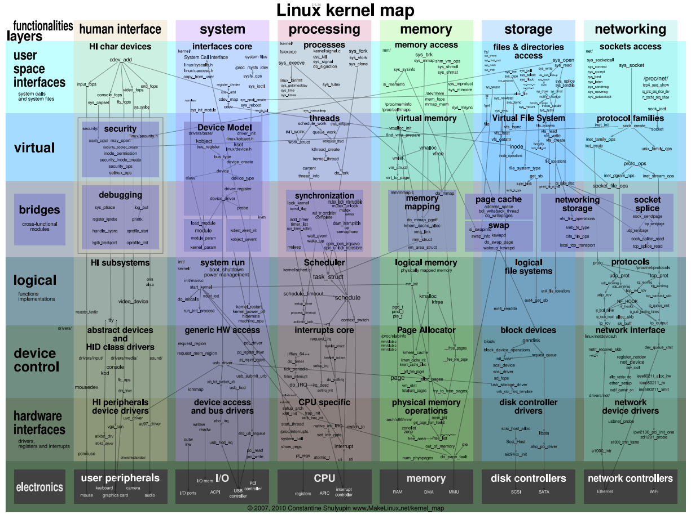

# 网络初始化



* 内核按功能可以为计算、存储、网络，功能繁杂，在最开始的引导阶段，毛也没有的时候，如何一步步逐个子系统初始化到第一个用户态进程运行，是很有讲究的一件事
* 内核中使用了initcall机制，网络子系统毫无疑问也是被initcall初始化的
* initcall机制与编译器狼狈为奸，达成了协议，将需要初始化的函数，按照特定顺序排列在".initcall"段中，

```
/*
 * A "pure" initcall has no dependencies on anything else, and purely
 * initializes variables that couldn't be statically initialized.
 *
 * This only exists for built-in code, not for modules.
 * Keep main.c:initcall_level_names[] in sync.
 */
#define pure_initcall(fn)		__define_initcall(fn, 0)

#define core_initcall(fn)		__define_initcall(fn, 1)
#define core_initcall_sync(fn)		__define_initcall(fn, 1s)
#define postcore_initcall(fn)		__define_initcall(fn, 2)
#define postcore_initcall_sync(fn)	__define_initcall(fn, 2s)
#define arch_initcall(fn)		__define_initcall(fn, 3)
#define arch_initcall_sync(fn)		__define_initcall(fn, 3s)
#define subsys_initcall(fn)		__define_initcall(fn, 4)
#define subsys_initcall_sync(fn)	__define_initcall(fn, 4s)
#define fs_initcall(fn)			__define_initcall(fn, 5)
#define fs_initcall_sync(fn)		__define_initcall(fn, 5s)
#define rootfs_initcall(fn)		__define_initcall(fn, rootfs)
#define device_initcall(fn)		__define_initcall(fn, 6)
#define device_initcall_sync(fn)	__define_initcall(fn, 6s)
#define late_initcall(fn)		__define_initcall(fn, 7)
#define late_initcall_sync(fn)		__define_initcall(fn, 7s)

/* initcalls are now grouped by functionality into separate
 * subsections. Ordering inside the subsections is determined
 * by link order.
 * For backwards compatibility, initcall() puts the call in
 * the device init subsection.
 *
 * The `id' arg to __define_initcall() is needed so that multiple initcalls
 * can point at the same handler without causing duplicate-symbol build errors.
 */

#define __define_initcall(fn, id) \
	static initcall_t __initcall_##fn##id __used \
	__attribute__((__section__(".initcall" #id ".init"))) = fn
```

* 上述的初始化还不是最基本的，它是有do_initcalls函数挨个调用，但在此之前还有更基本的初始化操作

```
/*
 * Ok, the machine is now initialized. None of the devices
 * have been touched yet, but the CPU subsystem is up and
 * running, and memory and process management works.
 *
 * Now we can finally start doing some real work..
 */
static void __init do_basic_setup(void)
{
	cpuset_init_smp();
	usermodehelper_init();
	shmem_init();
	driver_init();
	init_irq_proc();
	do_ctors();
	usermodehelper_enable();
	do_initcalls();
}


static initcall_t *initcall_levels[] __initdata = {
	__initcall0_start,
	__initcall1_start,
	__initcall2_start,
	__initcall3_start,
	__initcall4_start,
	__initcall5_start,
	__initcall6_start,
	__initcall7_start,
	__initcall_end,
};


static void __init do_initcalls(void)
{
	int level;

	for (level = 0; level < ARRAY_SIZE(initcall_levels) - 1; level++)
		do_initcall_level(level);
}

static void __init do_initcall_level(int level)
{
	extern const struct kernel_param __start___param[], __stop___param[];
	initcall_t *fn;

	strcpy(static_command_line, saved_command_line);
	parse_args(initcall_level_names[level],
		   static_command_line, __start___param,
		   __stop___param - __start___param,
		   level, level,
		   &repair_env_string);

	for (fn = initcall_levels[level]; fn < initcall_levels[level+1]; fn++)
		do_one_initcall(*fn);
}
```

* 其中，网络设备初始化```subsys_initcall(net_dev_init);```实现，

```
/*
 * Incoming packets are placed on per-cpu queues
 */
struct softnet_data {
	struct Qdisc		*output_queue;
	struct Qdisc		**output_queue_tailp;
	struct list_head	poll_list;
	struct sk_buff		*completion_queue;
	struct sk_buff_head	process_queue;

	/* stats */
	unsigned int		processed;
	unsigned int		time_squeeze;
	unsigned int		cpu_collision;
	unsigned int		received_rps;

#ifdef CONFIG_RPS
	struct softnet_data	*rps_ipi_list;

	/* Elements below can be accessed between CPUs for RPS */
	struct call_single_data	csd ____cacheline_aligned_in_smp;
	struct softnet_data	*rps_ipi_next;
	unsigned int		cpu;
	unsigned int		input_queue_head;
	unsigned int		input_queue_tail;
#endif
	unsigned int		dropped;
	struct sk_buff_head	input_pkt_queue;
	struct napi_struct	backlog;
};
```

* net_dev_init 主要工作，为每CPU创建softnet_data，注册软中断
* 所有网络初始不全都在```subsys_initcall(net_dev_init);```，还有网络协议栈注册```fs_initcall(inet_init);```用于注册网络协议


-
